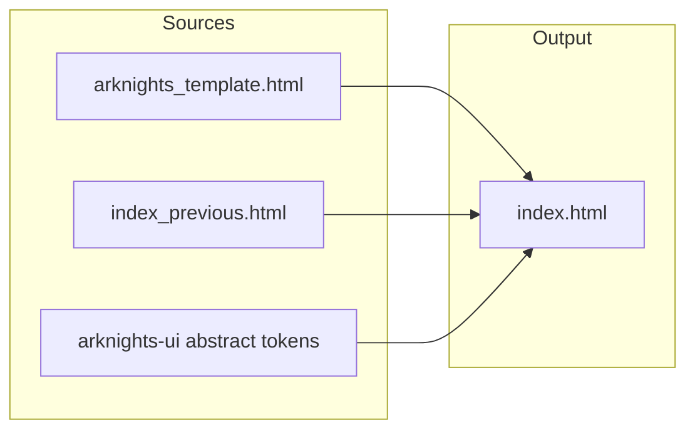

# AnimeDoll Web PPT → 明日方舟风格（index.html）

## 现状摘要

- **[arknights_template.html](E:\GitHub\animedoll.github.io\arknights_template.html)**：单文件，含 `:root` 代币（深青底、`#05a7dc` / `#ff5e19` / 浅灰面板）、顶栏 HUD、进度条、竖点导航、全屏、`.slide-frame` + `ak-sidebar`（VOICE 条、`chapter-pill`）+ `ak-card`、幻灯片过渡与 [约 500ms 的 `goToSlide` 逻辑](arknights_template.html)（IIFE 内，无全局暴露）。
- **[index_previous.html](E:\GitHub\animedoll.github.io\index_previous.html)**：**19 页**（`data-index` 0–18），完整 AnimeDoll 文案与 `images/` 资源引用；粉紫赛博风大量专用 CSS（5W1H 网格、SWOT、定位矩阵、BMC、故事版、CMF 图集等）；**粒子 Canvas** + **目录项 `onclick="goToSlide(n)"`**；导航脚本末尾 **700ms** `setTimeout` 与 `--slide-transition: 0.65s` 与模版不一致。
- **[mashirozx/arknights-ui](https://github.com/mashirozx/arknights-ui)**（`styles.css`）：可复用的是**抽象规则**——`Noto Sans SC` / `Noto Serif SC`、深底 + 半透黑条对话区、`#fdfdfb` / `#ebeceb` / `#424242` / `#161919` 面板、`#05a7dc` 与 `#ff5e19` 强调、左侧 `perspective` + `rotateY` 菜单感；**不**引入仓库内 `UI_HOME.png` 等精灵图（与现有 [.cursor/plans 说明](E:\GitHub\animedoll.github.io\.cursor\plans\arknights_web_ppt_dbab7c28.plan.md) 一致）。

## 目标交付

- 一个可部署的 **[index.html](E:\GitHub\animedoll.github.io\index.html)**：内容与页数与 `index_previous` 对齐，外观与交互与 `arknights_template` 一致并强化「方舟主界面」HUD 感。

## 实施步骤

### 1. 以模版为 HTML 骨架

- 保留模版的：`ak-topbar`、`.progress-bar`、`nav-dots` / `nav-arrow`、`slide-counter`、`fs-btn`、`.slides-wrapper` 结构。
- **元信息与资源**：从 `index_previous` 复制 `<title>`、favicon / `apple-touch-icon`（[`images/logo.ico` 等](index_previous.html)），必要时补充 `IBM Plex Mono`（模版已用）与 `Noto Serif SC` 的 `link`。
- **顶栏文案**：将 `RHODES ISLAND` 改为与 AnimeDoll 一致的标签（例如 `ANIMEDOLL` 或 `BRIEFING`），保留细线与右侧时间块。

### 2. 迁移 19 页正文 DOM

对每一页，用模版组件**重组**而非简单套色：

| 类型 | 做法 |
|------|------|
| 封面 | 保留主视觉 `images/effect_image_heroshot.jpg`，使用模版 `.cover-slide` / `.cover-hero` / `.cover-sub` 层级；去掉旧版 `glow-blob`、`deco-star` 等粉紫装饰。 |
| 目录 | 用模版 `.toc-grid` + `.toc-item` 呈现五大块；**保留跳转**：每格 `onclick` 需能调用 `goToSlide(2|7|12|17|18)`（见下节 JS）。 |
| 通用内容页 | 统一为 `.slide-frame`：`ak-sidebar` 放原 `section-label` 语义（如 `REQUIREMENT ANALYSIS`）+ `voice-strip`（从该页摘一句短说明）+ `chapter-pill`（章节名）；主区用 `ak-card` / `ak-card--cyan` / `mini-card` / `two-col` / `ak-list`。 |
| 复杂版式 | 自 `index_previous` **保留结构与文案**（5W1H 六格、SWOT 四象限、竞品矩阵、BMC、三栏功能、架构图、故事版、路线图等），重命名/收敛 class 为 `ak-*` 前缀块，避免与模版冲突。 |

图片页（白底/三视图/爆炸图/App UI/场景渲染）：放入 `ak-card` 内，用 `max-width` + `object-fit` 限制高度，保证 16:9 视口内可滚动或 `overflow:auto`（小屏不裁切关键信息）。

### 3. 样式合并策略

- **基底**：以模版 `:root` 与「背景渐变 + 低对比网格」为主，**删除** `index_previous` 的粉紫 `:root`、粒子、大面积 blur 幻灯片（模版为无 blur 横向切换）。
- **增量 CSS**：仅添加支撑 19 页所需的规则（5W1H、SWOT、条形图、矩阵、BMC、故事版等），**全部改用**模版代币：`var(--ak-cyan)`、`var(--ak-orange)`、`var(--ak-panel)` 等；原内联 `style="color:var(--pink-soft)"` 改为青/橙强调或删除。
- **SVG 渐变**（如 SWOT 页折线）：将 `stop-color` 从粉紫改为青/橙/深蓝灰，避免跳戏。

### 4. 脚本与行为对齐

- 采用模版中的 **IIFE** 导航（键盘 / 触摸 / 滚轮 / 进度条 / 圆点），并：
  - **`window.goToSlide = goToSlide`**（或在 IIFE 末尾赋值），以便目录项 `onclick` 与旧站行为一致。
  - 将 `setTimeout` 时长与 **CSS `--slide-transition`** 对齐（模版为 **~0.48s**，约 **500ms**），避免动画未结束就移除 class。
  - 为圆点补充 `aria-label`（模版已有）、`progressBar` 的 `aria-*`（模版已有）。
- **不迁移** `particles-canvas` 及整段粒子 `requestAnimationFrame`（符合方舟风与模版「无 Canvas 背景」）。
- **可选**：不迁移「3 秒隐藏光标」逻辑（模版无；若保留需评估全屏演示体验，默认建议省略以缩小 diff）。

### 5. 质量与边界

- **版权**：不添加 arknights-ui 的 `img/` 资源；仅字体 + 自绘 CSS/SVG。
- **a11y**：维持 `prefers-reduced-motion`（模版已覆盖）；保证浅底卡片上正文对比度。
- **路径**：继续沿用 `images/...`，与 GitHub Pages 根目录一致。

## 风险与工作量说明

- **体量**：合并后 `index.html` 会很长（预计远小于 3290 行，因去掉粒子与大量粉紫装饰重复），但仍是单文件维护。
- **视觉还原**：复杂页（BMC、矩阵）以「清晰可读 + 方舟配色」为准，不必像素级复刻旧版圆角玻璃拟物。

## 主要产出文件

- 新建/填满：[index.html](E:\GitHub\animedoll.github.io\index.html)（唯一必需修改的页面文件；`arknights_template.html` 与 `index_previous.html` 可保持只读参考，除非你希望事后删除重复模版）。

